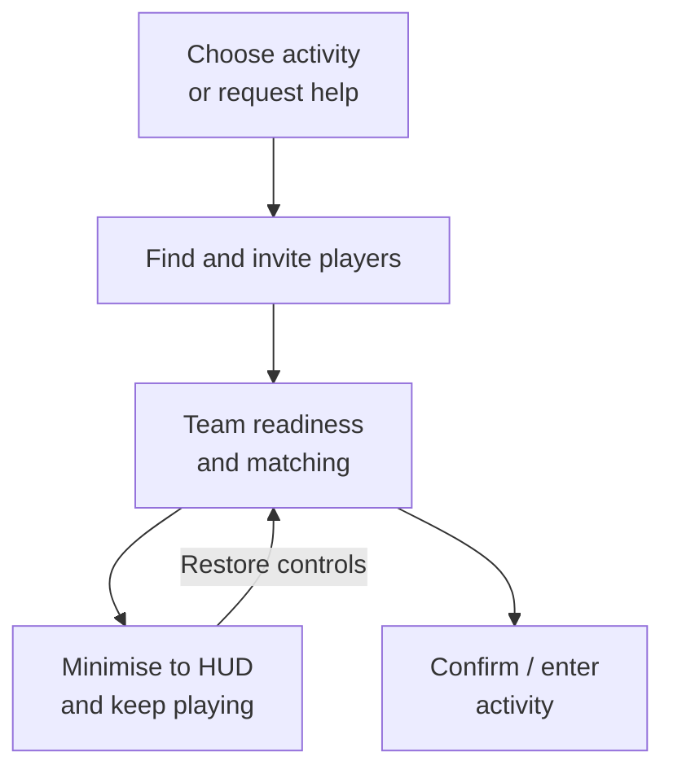

# Multiplayer UI: from finding teammates to playing together

**Evan (Yaxin) Ge · Lua / C++ / UMG · ProjectZ engineering case study**

Team setup, invitations, readiness, matching and support requests form one connected player experience across menus and gameplay. The challenge was keeping several views aligned with live multiplayer state.

I developed and maintained gameplay features and their associated UI, including team/support integration, compact status and follow-up fixes. I also implemented the right-side party HUD shown below. The work used the team's shared Lua/UMG framework and existing multiplayer services.

[中文案例](docs/README.zh-CN.md) · [Full case study](docs/CASE_STUDY.md) · [Architecture](docs/ARCHITECTURE.md) · [Code tour](docs/CODE_TOUR.md) · [Debugging](docs/DEBUGGING.md)

## Three engineering decisions

**1. Treat the full panel and compact notice as views of the same live feature.**

`TeamModel` derives presentation from membership, role, readiness and matching. Minimising changes presentation; leaving a team or cancelling matching is an explicit command. Players retain status and a route back to controls while continuing to play. [Team flow](docs/CASE_STUDY.md#flow-a-create-a-team-minimise-restore).

**2. Reuse player discovery, but preserve the meaning of the action.**

A world interaction carries an `AssistId` into the existing multiplayer browser. Lists and search are reused; support actions retain their context and distinguish offline, busy and pending players. Invitation state belongs to the native manager, not individual rows. The trade-off is context branching across layers. [Support flow](docs/CASE_STUDY.md#flow-b-request-support-from-a-gameplay-context).

**3. Diagnose UI failures through the complete data path.**

A support-search freeze involved a detail request whose completion triggered another request. A duplicate Lua method definition hid the effective callback. The historical fix removed that cycle; the included before/after test demonstrates terminating refresh behaviour. [Fix and regression evidence](docs/DEBUGGING.md).

Together, these decisions connect player-facing continuity, practical reuse and maintainable asynchronous behaviour.

## The player experience

Team formation and support are related entry points. They use existing services rather than one universal backend state machine.

## Gameplay footage and screenshots

Four separate examples from public Bilibili gameplay footage, with English captions. Original images and creator watermarks are preserved. [Source notes and label translations](media/SCREENSHOTS.md).

### 1. Team setup and invitations

The panel brings together the activity, current members and invitations. The crown identifies the leader; **Recommended / Friends / Recent / World** select invitation sources. The bottom button reads **Waiting to start**. **Minimise** returns to gameplay without leaving the team.

### 2. In-game party HUD

**Focus on the member list on the right, which I implemented.** Levels, names, health and distance remain visible during combat without opening the team panel. Open the image at full size to inspect the roster.

### 3. Finding players for support

Available rows offer **Invite for support**; an unavailable player is labelled **Busy**. Favourites, filters, refresh and search support discovery. My work connected this support context and availability feedback to the native invitation path.

### 4. Compact team-status notice

**Focus on the blue banner at the top centre.** It displays the activity and **Forming a team** status (组队中). This notice is distinct from the party roster; its implementation provides a route back to team controls. The displayed state is team formation, not evidence that matchmaking is active.

## Read the code in ten minutes

1. [TeamModel](Content/Lua/GameLogics/Team/TeamModel.lua): shared presentation state and open/hide/restore.
2. [Main frame](Content/Lua/GameLogics/Team/TeamMatching/TeamMatchingMainFrame.lua) and [compact notice](Content/Lua/GameLogics/Team/TeamMatching/TeamMatchingNotice.lua): role-dependent controls, commands and feedback.
3. [Multiplayer model](Content/Lua/GameLogics/MultiPlayer/MultiPlayerModel.lua) → [list panel](Content/Lua/GameLogics/MultiPlayer/MultiPlayerWorldListPanel.lua) → [player item](Content/Lua/GameLogics/MultiPlayer/MultiPlayerWorldItem.lua): support context, requests and availability.
4. [Native support manager](Source/ProjectZ/GameLogic/MultiPlayer/PzMultiPlayerManager.cpp): invitation dispatch and pending/cooldown ownership.
5. [Debugging](docs/DEBUGGING.md): historical callback fix, later maintenance and remaining validation targets.

## Scope and verification

Selected implementations preserve module paths and calling relationships. Omitted bodies are labelled; C++ headers are interface outlines. The full Unreal runtime, services and binary widgets are external. [Dependencies and widget contracts](docs/DEPENDENCIES.md) · [Implementation map](docs/source-manifest.json).

Focused tests execute Lua excerpts with controlled services, including the before/after callback case. They record an existing cache-miss assumption and do not claim device, renderer or shipping-performance validation. [Results and limitations](docs/TESTING.md). Screenshots illustrate separate states, not a continuous click-through. Game visuals and project material remain subject to their respective rights.

**Companion case:** [Building UI — contextual controls, crafting actions and world-object interaction](https://github.com/seak123/building-ui-portfolio).
