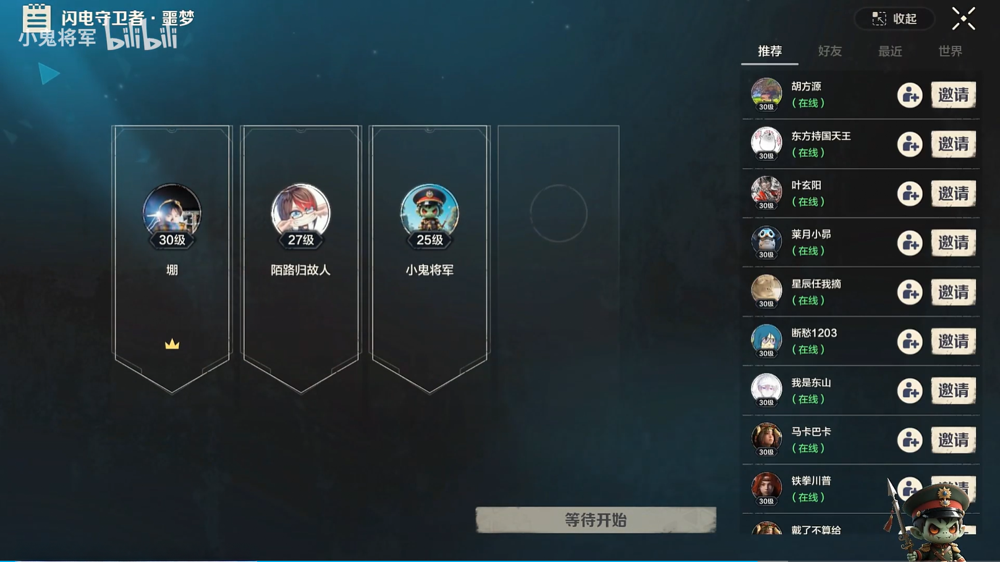
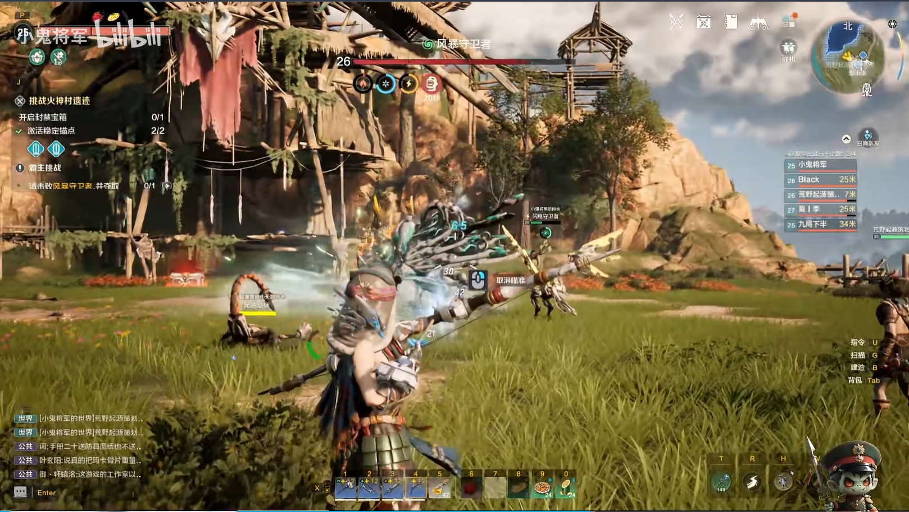
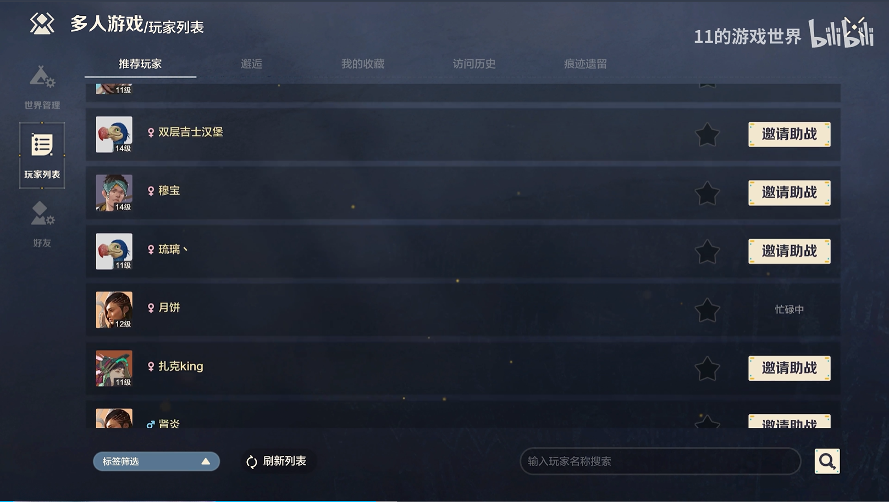
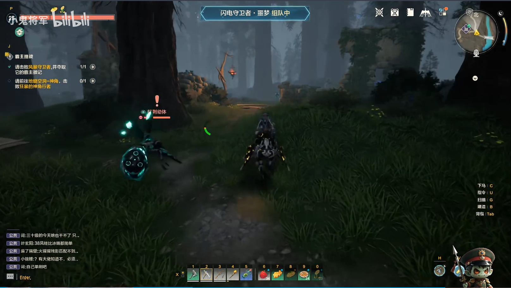

# Multiplayer UI: from finding teammates to playing together

Team setup, invitations, matching and support connect across menus and gameplay, with several views kept aligned to live multiplayer state.

**Evan (Yaxin) Ge · Lua / C++ / UMG · ProjectZ**

[中文 README](docs/README.zh-CN.md) · [Screenshots](#gameplay-footage-and-screenshots) · [Explore the work](#deeper-reading)

*Team setup: member slots, leader status and invitation sources share one panel. **Minimise** returns to gameplay without leaving the team. The displayed action is **Waiting to start**. [Footage credit and English label guide](media/SCREENSHOTS.md).*

## My work

I developed and maintained team and support gameplay with its associated UI, including the main-panel integration, compact team-status notice, right-side party HUD and follow-up fixes. The work connects Lua/UMG presentation to C++ systems and multiplayer services.

My focus was continuity across views, contextual invitations, asynchronous correctness and the cost of refreshing live data.

## Three questions and decisions

### 1. How can different matching systems present one coherent team state?

Arena and PvE matching used different protocols, stages and team records. I introduced a common UI-facing model boundary to translate those inputs into shared team state, while matching and cancellation retained mode-specific service dispatch.

The full panel and compact HUD derive their presentation from that shared state. Hiding or restoring a view is separate from leaving a team or cancelling a match. [Decision rationale](docs/DECISIONS.md#1-one-ui-facing-model-over-different-matching-systems) · [Panel and HUD flow](docs/CASE_STUDY.md#flow-a-create-a-team-minimise-restore).

### 2. How can support reuse player discovery without losing its purpose?

I carried the activity's support context into the existing multiplayer browser, reusing search, lists and player details. Row actions retain the support ID and distinguish offline, busy and pending players; the native manager maintains invitation waiting and cooldown state.

The same discovery UI can therefore support a different player intent without treating a sent request as an accepted invitation. [Support flow](docs/CASE_STUDY.md#flow-b-request-support-from-a-gameplay-context).

### 3. Which data needs refreshing, and when?

An iOS performance issue led me through native roster notifications, Lua list repopulation, item binding and detail queries. I gated structural notifications with a dirty flag and separated support-context updates from member-list refreshes.

Profile data needed a different policy: cache-permitted binding reduced repeated work, while later level-display maintenance restored explicit freshness through periodic forced queries and queries on binding. I treated roster structure, live combat values and richer player details as different update responsibilities. [HUD optimisation and maintenance](docs/HUD_PERFORMANCE.md).

## Outcomes

- Arena and PvE flows use a common presentation vocabulary while retaining their existing service paths.
- Players can minimise team controls, keep playing with status feedback, and return to the current team state.
- Stable membership avoids repeated structural refresh propagation; support-context changes have a narrower update path, and player details retain explicit refresh opportunities.
- A support-search callback cycle was removed so completing a detail request no longer starts the same request again. [Debugging case](docs/DEBUGGING.md).

## Deeper reading

- **Feature and architecture:** [Case study](docs/CASE_STUDY.md) · [Architecture](docs/ARCHITECTURE.md) · [Decision rationale](docs/DECISIONS.md).
- **Implementation:** [Guided code tour](docs/CODE_TOUR.md) · [TeamModel](Content/Lua/GameLogics/Team/TeamModel.lua).
- **Reliability and cost:** [Callback and availability fixes](docs/DEBUGGING.md) · [HUD performance](docs/HUD_PERFORMANCE.md).
- **Additional trade-off:** [Cached eligibility, immediate feedback and server authority](docs/DECISIONS.md#2-immediate-feedback-is-not-authoritative-eligibility).
- **Verification:** [Focused tests — added for this portfolio](docs/TESTING.md) · [Independent HUD demonstration model — not production code](examples/hud-refresh/HudRefreshModel.lua).
- **Evidence scope:** [Historical work, version boundaries, tests and footage](docs/EVIDENCE.md).

## Gameplay footage and screenshots

Open the four-view gallery with English captions

### 1. Team setup and invitations

The crown identifies the leader. **Recommended / Friends / Recent / World** select invitation sources; the action reads **Waiting to start**.

### 2. In-game party HUD

**Focus on the member list on the right.** Levels, names, health and distance remain visible during combat without opening the team panel. [The refresh work behind this HUD](docs/HUD_PERFORMANCE.md).

### 3. Finding players for support

Available rows offer **Invite for support**; an unavailable player is labelled **Busy**. Favourites, filters, refresh and search support discovery.

### 4. Compact team-status notice

**Focus on the blue banner at the top centre.** It displays the activity and **Forming a team** status. This is distinct from the party roster and provides a route back to team controls.

[Footage credits and label translations](media/SCREENSHOTS.md). These are separately labelled stills.

**Related cases:** [Building UI](https://github.com/seak123/building-ui-portfolio) · [Mechanical workers and world-space UI](https://github.com/seak123/mechanical-workers-ui-portfolio).
