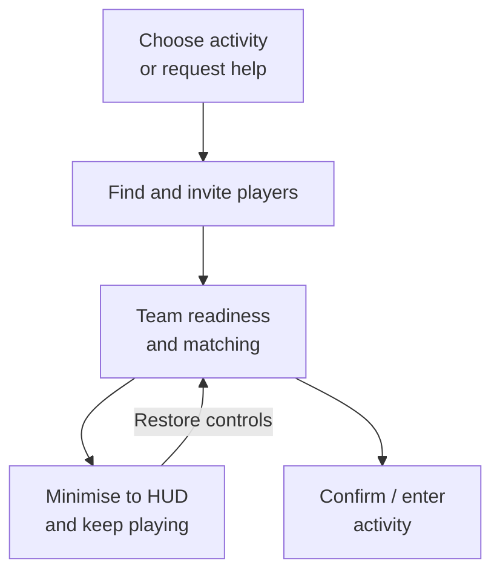

# Multiplayer UI: from finding teammates to playing together

**Evan (Yaxin) Ge · Lua / C++ / UMG · ProjectZ engineering case study**

A connected multiplayer UI feature: team setup, invitations, readiness, matchmaking, a compact HUD, and contextual requests for help. The engineering challenge was keeping player intent, live multiplayer state and several views aligned while the player continued playing.

I worked on the gameplay systems **and their associated interfaces**, including the team / support integration and subsequent maintenance. This case shows the UI work explicitly: view behaviour, data selection, state-dependent controls, asynchronous updates and the native interfaces behind them. This case study organises my work records around the implementation, its design decisions and selected code. It is a source-reading portfolio, not a standalone Unreal project.

[中文导读](docs/README.zh-CN.md) · [Full case study](docs/CASE_STUDY.md) · [Architecture](docs/ARCHITECTURE.md) · [Code tour](docs/CODE_TOUR.md) · [Debugging](docs/DEBUGGING.md)

## The player experience

The team and support paths are related entry points, **not one universal backend state machine**. The full team panel and compact HUD share team state. The support path reuses the multiplayer browsing interface with a different action context.

### Gameplay footage and screenshots

Four complementary views from publicly available Bilibili gameplay footage, with English captions explaining the Chinese interface. These are separate examples, **not a recording of one continuous user flow**. Original images and creator watermarks are preserved. [Source notes and UI label translations](media/SCREENSHOTS.md).

#### 1. Team setup and invitations

The main panel brings together the activity, current members and invitation controls. The crown identifies the team leader; the right-hand list offers **Recommended / Friends / Recent / World** tabs and **Invite** actions. The bottom button reads **Waiting to start**. **Minimise** at the top right provides a way back to gameplay without leaving the team.

#### 2. In-game party HUD

**Focus on the member list on the right.** I implemented this party HUD. It keeps member levels, names, health and distance visible during combat, without opening the full team interface. Open the image at full size to inspect the roster.

#### 3. Finding players for support

The multiplayer browser presents support invitations alongside availability feedback. Available rows offer **Invite for support**, while an unavailable player is labelled **Busy**. Favourites, tag filters, list refresh and name search help players find someone to invite. My work connected the support context and player availability to the interface and its native request path.

#### 4. Compact team-status notice during gameplay

**Focus on the blue banner at the top centre.** It displays the activity and team-formation status (组队中) while the player remains in the game world. This notice is separate from the right-side party roster above. The implementation supports reopening the team controls from the notice; this still image shows the compact view, not the click transition. The displayed status does not establish that matchmaking is running.

## Three decisions worth examining

**1. A compact HUD is another view of a live feature, not a second copy of its state.**

`TeamModel` derives the display state from team membership, role, readiness and matching status. Both the full panel and the HUD consume that state. Reopening a view reads current data; hiding a panel is distinct from leaving a team or cancelling matchmaking.

**2. Reuse the player-browsing UI, but make the action context explicit.**

A support interaction carries an `AssistId` from a native world interaction into the Lua model. The panel switches to support mode; the list presents players and support actions instead of simply browsing worlds. Availability, pending invitations, busy activities and offline players need different presentation. Reuse reduced duplication, but also introduced conditional complexity that needs deliberate ownership.

**3. Treat asynchronous UI refresh as a data-flow problem.**

A historical support-search freeze exposed a request → notification → refresh → request cycle. The fix removed the re-entrant completion path. The repository includes historical before/after method excerpts and a bounded Lua regression test, alongside a candid discussion of remaining assumptions in later code.

## Implementation scope

The case covers team controls, the in-game party HUD, the compact team-status notice, contextual support interactions and follow-up fixes across Lua and C++. The shared Lua/UMG framework and multiplayer infrastructure were maintained collaboratively by the team; the feature uses their existing bindings, lists, loading and service contracts.

## Read the code in ten minutes

1. [TeamModel.lua](Content/Lua/GameLogics/Team/TeamModel.lua): `UpdateTeamFrameViewState`, open/hide/restore, data-sync events.
2. [TeamMatchingMainFrame.lua](Content/Lua/GameLogics/Team/TeamMatching/TeamMatchingMainFrame.lua) and [TeamMatchingNotice.lua](Content/Lua/GameLogics/Team/TeamMatching/TeamMatchingNotice.lua): full view, compact view, commands and feedback.
3. [MultiPlayerModel.lua](Content/Lua/GameLogics/MultiPlayer/MultiPlayerModel.lua) → [MultiPlayerWorldListPanel.lua](Content/Lua/GameLogics/MultiPlayer/MultiPlayerWorldListPanel.lua) → [MultiPlayerWorldItem.lua](Content/Lua/GameLogics/MultiPlayer/MultiPlayerWorldItem.lua): support context, data requests and per-player state.
4. [Native support manager](Source/ProjectZ/GameLogic/MultiPlayer/PzMultiPlayerManager.cpp): request dispatch, cooldown ownership and UI notification.
5. [Debugging and tests](docs/DEBUGGING.md): distinguish the historical fix from the tests and improvement proposals added for this portfolio.

## Scope and verification

Module paths, selected function bodies and call relationships remain visible. Out-of-scope Lua bodies use a short `-- Implementation omitted.` comment; the test harness rejects calls into these placeholders. C++ headers are labelled interface outlines; the original engine, generated configuration/protocol code, services and UMG binaries are not included. See [dependencies and widget contracts](docs/DEPENDENCIES.md).

The focused tests execute real Lua excerpts with fake native services. They do **not** validate rendering, multiplayer transport, Unreal compilation, console behaviour or shipping performance. No FPS, memory or request-rate improvement is claimed without a measurement. Run instructions and limitations: [TESTING.md](docs/TESTING.md).

See the [implementation map](docs/source-manifest.json) for file paths and included methods. Game visuals and project material remain subject to their respective rights; this repository grants no licence to the original game assets.
