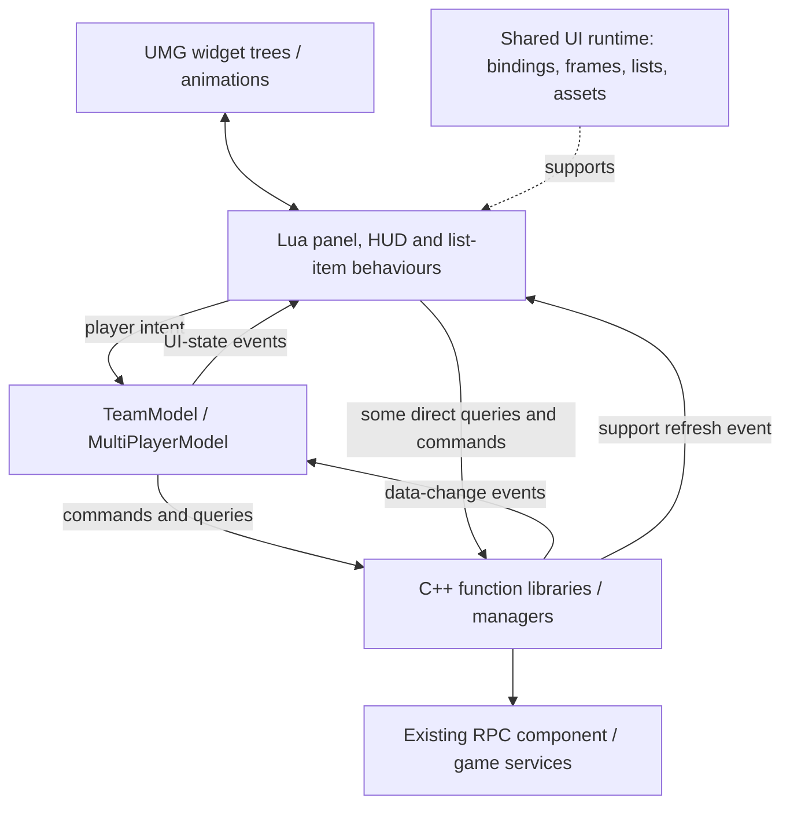

# Architecture and framework integration

[Overview](../README.md) · [Dependencies](DEPENDENCIES.md) · [Code tour](CODE_TOUR.md)

## Responsibilities and direction of communication

This is the actual practical separation, including direct view-to-native calls. It is not a cleaned-up diagram that pretends every operation passes through a view-model.

### Native data and services

`UPzTeamManager` exposes team snapshots and readiness queries. `UPzTeamFunctionLibrary` provides the Lua/Blueprint-facing command boundary and forwards requests to the existing RPC component. `UPzMultiPlayerManager` owns support invitation cooldown entries and emits refresh events when that state changes. Backend protocol handling and authority checks remain external to this case study.

### Feature models

`TeamModel` owns UI-facing identity/target fields, stage, frame references and derived HUD state. It reads native state and coordinates presentation. The existing matching manager can also indicate active matching, so `IsMatching()` considers more than the model's local stage.

`MultiPlayerModel` owns the current `AssistId` and opens the appropriate panel context. It does not implement the support service or duplicate the list framework.

### Views

The main team panel owns widget presentation, list population and role-dependent controls. The notice presents a compact summary. The support parent panel chooses content; the list panel handles query/refresh/search flow; the list maps records to view data; each item renders its player's available action.

Keeping these responsibilities understandable is more important than forcing a retrospective architectural label onto every class.

## How a UMG widget becomes a Lua interface

The team's shared framework links native widget lifecycle to Lua behaviour instances:

1. Native widget creation/destruction broadcasts through the widget delegate manager.
2. `BehaviourManager` creates a behaviour for the widget, maps it by native unique ID and binds lifecycle delegates.
3. `LuaBehaviour` processes `Elements`, `Behaviours`, `Events`, `Timers` and other settings. Elements bind named UMG controls and callbacks; behaviours link child components.
4. On destruction, framework cleanup clears scoped events, bindings and the native-object association.

The case uses this directly. For example, `TeamMatchingMainFrame` names its member widgets and button handlers in `setting`; `TeamMatchingNotice` declares its state events and half-second timer there.

The shared runtime was maintained collaboratively by the team. Feature integration used these contracts and fed requirements back into UI design discussions. The full runtime is outside the scope of this case.

**Important distinction:** the existence of a `_visibleScope` name does not prove all subscriptions stop while a widget is hidden. In the inspected framework, some enable/disable subscription code is commented out. Destruction cleanup and visibility-based suspension must not be conflated.

## Asynchronous frame creation

`UIUtil.AddUniqueFrameAsync(path, callback)` is the feature-facing API. The native frame manager tracks pending asynchronous creation and realised frames separately. A feature callback receives the widget, resolves its Lua behaviour through its unique ID, then supplies content.

This avoids placing asset loading and behaviour construction inside every feature, but it does not automatically prove that every feature callback is safe after context changes. For example, a player can close a panel or change activity before an asynchronous load completes. The exported feature code is historical code; it is not retroactively amended with a request generation/cancellation design. A proposed validation strategy appears in [TESTING.md](TESTING.md).

## Lists: two separate kinds of reuse

The project uses native ListView entries plus a Lua-to-UObject data bridge. A Lua table becomes a data object through `DataObjectPool:Get`; native list callbacks resolve that object to Lua item data. The shared runtime also manages release/reuse.

There are two distinct costs here:

- **Widget entry reuse/virtualisation:** whether the view instantiates an entry for every record or reuses visible entries.
- **Data-handle reuse:** allocations and lifetime of objects carrying Lua data through native APIs.

Using the data pool does not itself prove a specific number of visible widgets, zero allocation, or a measured frame-rate improvement. In this feature, it preserves the established list integration. `UpdateInviteList` still clears and repopulates the list; it is not an incremental diff algorithm.

## Asynchronous image assignment

The shared native image helper checks the requested path, uses an already resolved asset when possible and guards asynchronous completion using both a weak widget reference and the currently expected path. This matters when a reused widget is rebound before a prior image finishes loading: a valid widget can still be the **wrong recipient for the old result**.

The notice consumes this through `UIUtil.SetImagePathAsync`. That is a specific connection between a feature need and framework behaviour I understand and apply. It is not a claim that the feature implements its own loader or that all other callbacks share the same protection.

## Timers and performance boundaries

The feature is primarily event-driven, not exclusively event-driven. The full panel requests player details periodically (five-second timer in the inspected code); the HUD formats matching elapsed time on a half-second timer. The HUD reads elapsed time from the native matching manager instead of accumulating a separate Lua counter.

The support list also contains a later 300 ms search debounce, cancelling the pending scoped timer on new input. This is part of the shared browsing implementation. It can reduce intermediate queries during typing; it neither guarantees one request per user interaction nor prevents an older response arriving after a newer one.

For a dedicated performance investigation I would measure refresh counts, request fan-out, Lua/native allocations, active subscriptions and game-thread UI work independently. No such measurements are fabricated for this repository.
