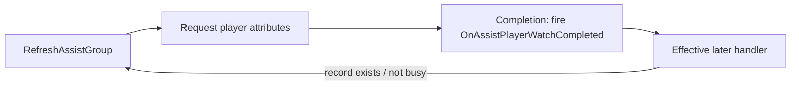
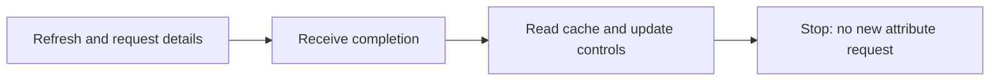

# Debugging — break the cycle, preserve the flow

[Overview](../README.md) · [Tests](TESTING.md)

## Support search: a reproducible freeze

**Context.** Searching for a player in the support interface was reported as reliably freezing. The useful unit of investigation was the complete item-refresh / player-detail completion path, not the visual complexity of the row.

**Implementation change.** The fix removed a repeated request block and a duplicate `OnAssistPlayerWatchCompleted` definition in `MultiPlayerWorldItem.lua`.

### The effective pre-fix path

The source contained two definitions of `OnAssistPlayerWatchCompleted`. In Lua the later assignment wins. For a real recommended player whose cached record exists and whose current map is not marked busy, that later handler called `RefreshAssistGroup`.

This gives a concrete feedback cycle. Depending on whether the attribute API completes synchronously from cache or asynchronously, it can manifest as re-entrancy or repeated queued work. The repository does not claim to reproduce the original device stack trace or quantify network traffic; the callback cycle is what the source and focused test establish.

### What changed

The fix removed the later duplicate handler and the repeated request in the retained handler. The resulting completion path reads cached detail data, checks the busy-map condition and updates the action state without issuing another request.

Read the extracted [before](../tests/fixtures/assist_refresh_before.lua) and [after](../tests/fixtures/assist_refresh_after.lua) functions. They preserve the duplicate definitions in the pre-fix version intentionally. These focused fixtures illustrate the failure and fix; they are not complete production modules.

### Investigation

I traced what happened after the search result was assigned to a row. Updating the row requested player details; completion fired an event; the effective event handler refreshed the row again. A duplicate Lua method definition made the active path less obvious. The important change was to make completion update the view without starting the same request again, and then check both normal and busy-player states.

The callback sequence is inspectable in the included functions. This case does not report profiler measurements or device-level timing.

### A regression test added for this portfolio

The test supplies a fake attribute service that queues callbacks. For the pre-fix fixture, draining a bounded number of callbacks leaves more work queued and keeps increasing request count. For the post-fix fixture, the same setup reaches an empty queue after one completion. The busy-map branch is tested separately.

The bound deliberately avoids an infinite test. It proves termination of this **specific** path after the fix, not absence of every asynchronous bug in the game.

## Availability was more than “already invited”

**Symptom.** After clicking an online player's invite action, offline rows could incorrectly gain an invitation button.

**Fix.** Partial invitation-state updates were replaced with a call to `RefreshAssistState` for normal players.

The old partial path looked at whether an invitation was pending, but that is only one dimension of eligibility. The complete path also considers offline and busy-map state. A global refresh event must cause each item to recalculate its own complete state; it must not make every item resemble the one the player clicked.

This is a state-consistency fix, not a claim of rendering optimisation. The tests exercise offline, busy, available and pending states independently.

## Favourites and asynchronous detail arrival

The fix added the favourites-list completion event and a handler that refreshes the list when that tab is active. It addressed a support-player availability presentation problem on the favourites tab. The general point is that changing a tab and completing its data update are separate events. A view needs the correct completion signal, not merely a one-time refresh when opened.

## Remaining edge cases

The current exported code evolved after the narrow historical fix. `RefreshAssistGroup` requests details and then calls `RefreshAssistState`; it no longer uses the old global completion cycle. However, it still has assumptions worth testing:

- `RefreshAssistState` accesses `record.CurrentMapId` on an online path without first checking that the cached record exists. A missing-cache test records this as an expected failure of the excerpt under that input. Whether the production caller guarantees a cache entry requires the full runtime contract.
- The detail callback captures a requested ID but refreshes `self` without an explicit current-item ID or lifecycle guard. Recycled entries and closed panels deserve tests; no universal stale-callback protection is claimed.
- Frame uniqueness is not the same as cancellation of an obsolete open intent. Late frame creation after closing/changing activity needs lifecycle validation.
- Search debounce limits intermediate submissions; it is not response ordering. A request generation or context token is a reasonable next improvement if the service can deliver out of order.

These are validation targets and proposed improvements, separate from the fixes described above.
